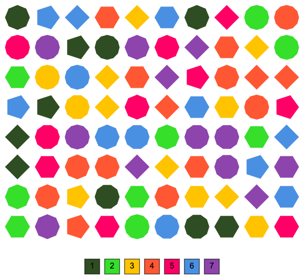

# El reto más difícil: verano 2024

El reto más dificil es una iniciativa donde podrás demostrar tu ingenio y de habilides para descifrar y resolver retos.

[Javier Vélez Reyes](https://www.linkedin.com/in/javiervelezreyes/) nos propone una serie de retos para ir descifrando durante las semanas de verano para jugar en comunidad.

Next Digital lo hace posible dando soporte tecnológico y realizando actividades de difusión y seguimiento.

Más info en [elretomasdificil.com](https://elretomasdificil.com/).

## Semana 1: CRIPTOGRAFÍA

> Tuvimos que esconder los guiños
> con argucias, con engaños
> respetamos cada espacio
> mas cambiamos sin dudarlo.
> Cada letra eran tres menos
> y como un círculo cerrado
> las tres primeras las últimas
> que las últimas ya cambiaron
> 
> Urphr hvshud hq Urpd
> 
> ¿Dónde esperaba Romeo?

El problema se basa en el [método de cifrado César](https://es.wikipedia.org/wiki/Cifrado_C%C3%A9sar). La solución es ejecutar el script de la semana 1 pasándole el mensaje y la clave de cifrado.

```bash
python week_1.py --mensaje "Urphr hvshud hq Urpd" --clave 3
```

## Semana 2: LOS ESTIBADORES

> Un puerto de piezas lleno
> tantos lados dicta el peso
> y el color su valor sin receso.
> En el barco cien kilos caben
> mas cuanto mas valor más valen
>
> ¿Cómo llenamos el barco
> para hacernos millonarios?



He creado un CSV con dos columnas, la primera el número de lados de cada forma y la segunda con el valor asociado al color de cada una de las mismas. Este fichero CSV, junto con el límite de carga del barco, se le pasan al script de Python creado para el reto de esta semana y el resultado se muestra por pantalla.

```bash
python week_2.py --csv week_2.csv --almacenamiento 100                                                                                                                                                                                                                                                         ─╯
```
